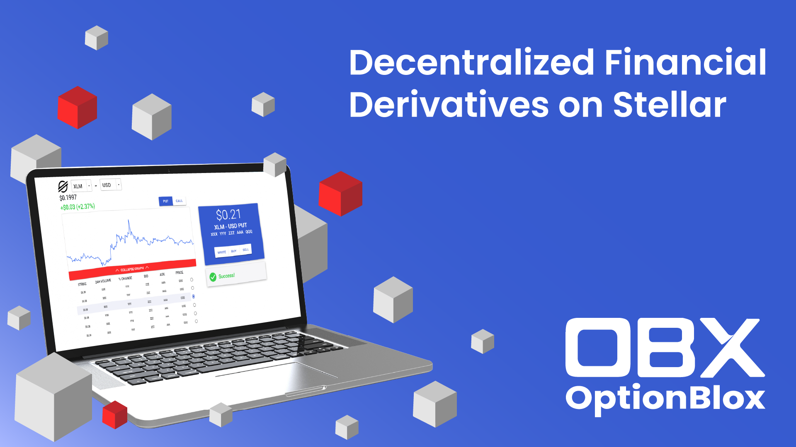

# Welcome to OptionBlox

Welcome to the OptionBlox docs page. OptionBlox is a [Turing Signing Server](https://tss.stellar.org/) DeFi protocol for writing, trading, and executing financial derivatives on Stellar. This docs page provides information on the value provided by OptionBlox as well as the technical details of the protocol. 

As you can probably tell, this docs page is currently under development. We will continue to add more content here as the OptionBlox project gets further under way.

OptionBlox's Stellar Seed Fund Submission: https://communityfund.stellar.org/seed-fund#/entry/1e354b3b328209c85dc1d978cb1ea527d5df60dc04d8ae794f04517bea01d852

[Back to OptionBlox](https://www.optionblox.com/)

### Documentation

[Whitepaper](./Whitepaper.md)

[Use Cases](./UseCases.md)

### Roadmap
 1. *Q4 2020*
   - Finalize Website
   - Continue Application Development
   - Expand Fundraising Efforts
   - Explore Ecosystem Partnerships
 2. *Q1 2021*
   - Roll-out Full Demo/Alpha
     - Functional Testnet Application
   - Explore Market Maker Partnerships
 3. *Q2 2021*
   - Launch Open-Beta for Covered Options
   - Launch Closed Alpha for Uncovered Options and Futures
   - Launch Closed Alpha for OTC contract development tool
   