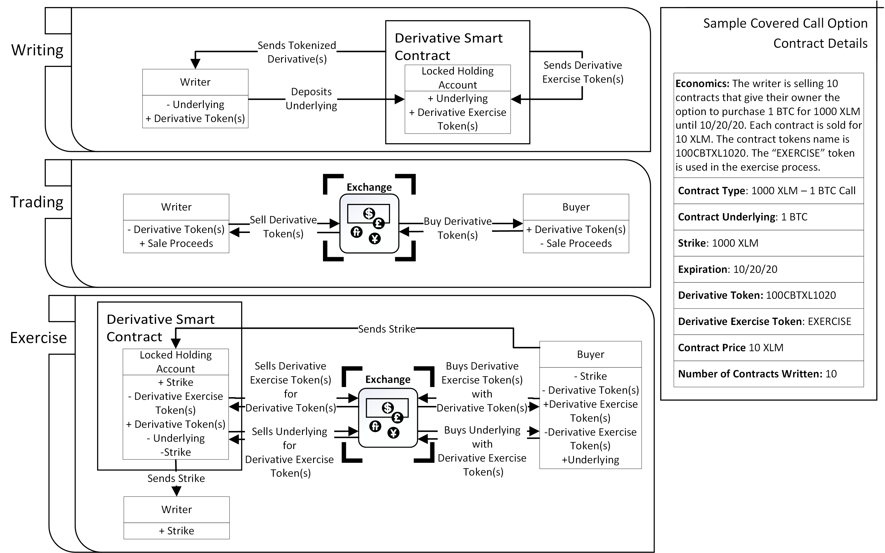
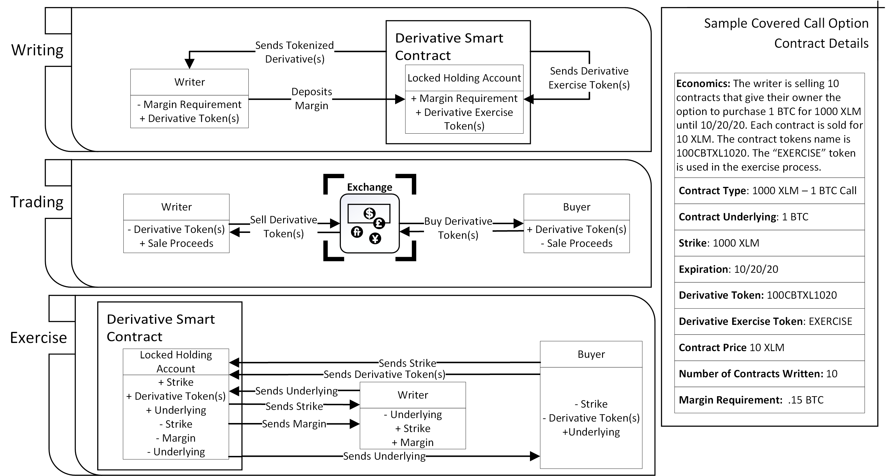

# OptionBlox
## A Decentralized Derivatives Solution Built on Stellar

Markus Paulson-Luna: markuspaulsonluna@optionblox.com\
Andrew Pierskalla: andrew@optionblox.com\
Alexander Mootz: alex@optionblox.com

&nbsp;

### Abstract

This whitepaper covers some of the technical details involved in OptionBlox's decentralized derivative protocols. These protocols are made up of a network of protocol tokens, accounts, and TSS(Turing Signing Server) txFunctions. This whitepaper will be continually updated as details regarding OptionBlox's core protocols change. Currently it covers the covered and uncovered option protocols along with the specifications of option contracts written using OptionBlox. The OptionBlox team plans to add details regrading our futures, swaps, and forwards protocols once those protocols get closer to launch.

&nbsp;

### Table of Contents:
- [Introduction](#introduction)
- [Contract Design](#Option-Contract-Design)
- [OptionBlox's Derivative Protocols](#txfunction-derivative-protocols)

&nbsp;

### Introduction:
The OptionBlox protocol serves as a tier-3 blockchain app, a layer between OptionBlox web-app users and the Stellar ledger. Users link their wallets to OptionBlox's web-app which takes user inputs and communicates them to the OptionBlox protocol. The OptionBlox protocol uses TSS(Turing Signing Server) txFunctions to build Stellar transactions that write, execute, or cover derivatives for users. Users approve these transactions with their wallet and receive the result of their transaction, whether that’s derivative tokens, collateral deposits, or underlying assets.

#### High-Level Protocol Diagram

 

### Option Contract Design

#### Contract Terms
OptionBlox option contracts are all standard american style options. This means they can be executed at any time until the expiration date. Currently OptionBlox only offers covered option contracts, this means that the full underlying asset balance associated with the option contract must be provided to write the option. However, the OptionBlox team has a uncovered option protocol that we plan on rolling out in the future. This protocol would allow users to write option contracts by only providing a portion of the associated underlying asset. 

#### Contract Sizing
Contract sizes are standardized by option type. This means that options and futures contracts have uniform underlying amounts. For example, all ETH-USD options and futures will have an underlying of 1 ETH. This standardization helps maintain contract volume. Option contract sizes are stored as a data entry in the option token's issuing account. They are also displayed on the OptionBlox web-apps market page and can be pulled from OptionBlox's api endpoints. Contract sizes are will be set to keep strike prices within a 3 digit range for standard options and a 4 digit range for options with USD as their counter asset. Contract sizes can be adjusted if the underlying assets value changes to no longer allow for the desired strike price digit ranges.

#### Partial Contracts
Tokenizing derivatives allows OptionBlox users to write partial derivative contracts. Users can write option contracts with fractions of the contract underlying assets and will be sent an equivalent proportion of the contract token(s). This is crucial to maintain standardized contract sizes while allowing users with less capital to still utilize the derivatives ecosystem.

For example, say the contract size for OptionBlox ETH-USD options is 1 ETH, this means that the underlying associated with these contracts is 1 ETH and users need to provide 1 ETH as collateral to write an ETH-USD option. If a user can only provide .5 ETH, our partial derivative capability allows them to write half an option contract. They will provide .5 ETH as collateral and receive .5 ETH-USD option tokens to sell. 

### Derivative Tokens
Derivative contracts written with the OptionBlox protocol are tokenized. This is critical to ensure they can be traded on any cryptocurrency exchange, they can be stored in any wallet, and the efficacy of the execution txFunction.

#### Option Token Naming Conventions:
The OptionBlox protocol uses 11 character names for it's option tokens. The token names convey the assets involved in the option, the option's strike price, the option's expiration date, and whether the option is a put or call. More information, such as contract size, is stored in the token's issuing account.
##### Standard Option Token Naming Convention
For most options the naming convention will be the following:
- XXX(First, Second, and Third characters of the option token name)\
The last three numbers of the strike price. For example, if the contract strike price is 125 these characters will be "125". Strike prices should not be more than three numbers and should not involve decimals. Contract size will be adjusted to ensure that these strike price characteristics remain true.
- XX(Fourth and Fifth characters of the option token name)\
The first two characters of the underlying asset token name. For example, if the contract underlying is XLM, these characters will be "XL".
- XX(Sixth and Seventh chacters of the option token name)\
The first two characters of the counter asset token name. For example, if the counter asset is BTC, these characters will be "BT".
- XX(Eigth and Ninth characters of the option token name)\
Month the option expires in. For example, if the option contract expires in July these characters will be "07".
- X(Tenth characater of the option token name)\
Settlement period the option expires in. For example, if the option contract expires on July 1st 2020, the first settlement period for outstanding options for the month of July, this character will be "0". Unfortunatley we cannot represent an actual day here due to character limits. So we represent the settlement period instead, the first settlement period of a month will be the first date in the month where options will settle, the second period will be the second date, and so on and so forth. Below is a table that exhibits this. Referring to the table, once 07/01/21 expires, 07/01/23 will be issued and its settlment period code will be 0.  

|Date:|07/01/21|07/07/21|07/14/21|07/21/21|07/28/21|07/01/22|07/07/22|07/14/22|07/21/22|07/28/22|
|---|---|---|---|---|---|---|---|---|---|---|
|Settlement Period:|0|1|2|3|4|5|6|7|8|9|
- X(Eleventh character of the option token name)\
P or C based on whether the option is a put or a call. For example, if the option is a put the character will be "P".

To bring it all together the name of a XLM-EURT Call Option with a contract size of 1000 XLM and a strike price of 350 expiring on 7/14/2021 would be XLEU350072C

##### Naming Convention for Options with USD as the counter asset
Through the OptionBlox web-app users are encouraged to write/buy options with USD as the counter asset. This is to concentrate market volume into asset pairs that include USD. Since options that have USD as a counter asset will be much more common as a result of this measure, we use a slightly different naming convention for options with USD as the counter  asset.
- XXXX(First four characters of the option token name)
Last four digits of option contract's strike price. For example, if the strike price is 1245 these characters will be "1245".
- XXX(Fifth, Sixth, and Seventh characters of the option token name)
First three characters of the underlying asset token's name. For example, if the underlying asset token is ETH, these characters will be "ETH". 
- XX(Eight and Ninth characters of the option token name)
Month the option expires in. For example, if the option contract expires in november these characters will be "11".
- X(Tenth character of the option token name)
The settlement period the option expires in for that month. For example, if the option contract expires on November 14th 2022, the seventh settlement period for outstanding options for the month of November, this character will be "7". For a further explanation on settlement period see the preceeding section.
- X(Eleventh character of the option token name)
P or C based on whether the option is a put or call. For example, if the option is a call contract the character will be "C".

### txFunction DerivativesProtocols:
OptionBlox features a range of tradeable decentralized derivative products. These are enabled using a variety of TSS txFunctions. Their code is available on our [GitHub](https://github.com/optionblox/optionblox-contracts). In this section we will give a high level overview of how their protocol's function without going in-depth on the ledger transactions involved.

#### Covered Options
OptionBlox covered options are created using a network of accounts and TSS txFunctions.

##### Tokens Involved
1. *Option Token*\
The option token represents ownership of the option contract. It is issued to the contract writer, they can then sell it on the DEX or any other cryptocurrency exchange. The option buyer uses this token to execute the option contract.

2. *Option Exercise Token*/
The option exercise token is used by the protocol to execute the option contract. It is purely a protocol token and users will not interact with it on their own volition. The exercise tokens name is the same as the derivative tokens name.

3. *Underlying Asset Tokens*/
Tokens that represent the option contract's underlying asset. These are locked in the writer's holding account to write call options.

4. *Counter Asset Tokens*/
Tokens that are used to purchase the option contract's underlying asset during the contract execution. These are locked in the writer's holding account to write put options.

##### Accounts Involved
1. *Writer Holding Account*\
This account holds the writer's underlying or counter assets. It is controlled by the Write txFunction, the Execute txFunction, the Settle txFunction, the earlyCLose txFunction, and the Close txFunction. The writer has no control over this account until the option contract either expires or is covered. 

2. *Option Token Issuing Account*\
This account issues the derivative token that represents ownership of the option contract. It also stores contract details in it's data entries. It is contolled by the Write txFunction.

3. *Exercise Token Issuing Account*/
This account issues the derivative exercise token that is used to execute the option. It is controlled by the Write txFunction and the Execute txFunction.

##### Covered Options txFunctions
1. *Write txFunction*\
Intakes contract parameters from the option contract writer, sets up the writer's holding account, and issues the derivative token to the contract writer.
2. *Execute txFunction*\
Intakes execution request, derivative token, and required underlying(for puts) or counter(for calls) asset tokens from the option contract owner. Then sends the underlying(for calls) or counter(for puts) asset tokens to the contract owner.
3. *Settle txFunction*\
Sends the proceeds from execution to the option contract writer and deletes the now void derivative and derivative exercise tokens.
4. *Close txFunction*\ 
Called after option contract expiration. Returns the commited underlying or counter asset tokens to the contract writer and deletes the derivative tokens, exercise tokens, and holding account. This contract will also perform the Settle txFunction's operations if that txFunction has not already been called.
5. *earlyClose txFunction*\
Called in the case where an option contract is exercised before the expiration date or the writer covers their option by buying an identical option token. Returns the commited underlying to the writer if the option was covered, deletes the now void derivative and derivative exercise tokens, and deletes the writer's holding if the option was fully exercise or covered. This contract will also perform the Settle txFunction's operations if that txFunction has not already been called.
##### Covered Options Protocol Diagraom
Below is a basic model showing the writing, sale, and exercise processes of a covered call with an underlying of 1 Bitcoin(BTC), and a strike price of 1000 Lumens(XLM).

##### Uncovered Options
OptionBlox uncovered options are similar to OptionBlox covered options. The key differences are the holding account also serves as a margin account for the seller and the execution process differs slightly. This protocol uses the same accounts and tokens as the covered options protocol. The txFunctions that power this protocol perform the same functions as the ones involved in the covered call protocol, the txFunctions just have different operations.

##### Uncovered Options Protocol Diagram
Below is a model showing the writing, sale, and execution process of an uncovered call. The call contract's underlying is 1 BTC, its strike price is 100 XLM, the initial margin requirement is 15%, and the minimum margin requirement is 10%.

##### Futures
OptionBlox futures also operates using a network of accounts and TSS contracts. Instead of using derivative tokens, the futures protocol issues tokens for the underlying asset, so a party who enters a contract with an underlying of 100 XLM would receive 100 XLMFUTURE tokens. Contract parties exchange these tokens to enter a futures contract; the price they exchanged tokens at represents the spot rate the future is entered at. OptionBlox settles futures daily using a [mark-to-market](https://www.cmegroup.com/education/courses/introduction-to-futures/mark-to-market.html] system. The txFunctions for this protocol are not finalized yet so we will add more details on this protocol to this whitepaper as it gets closer to launch.

##### Forwards
We have an internal forwards protocol we plan to implement in the future. It is a modified version of the OptionBlox futures protocol. We will add details regarding this protocol to this whitepaper once the protocol gets closer to launch

##### Swaps
We have an internal swaps protocol we plan to implement in the future. It is a modified version of the OptionBlox futures protocol. We will add details regarding this protocol to this whitepaper once the protocol gets closer to launch.

##### Liquidation Prodecures
OptionBlox uncovered options require position liquidation when the position holders become delinquent in meeting their margin requirements or fail to provide the necessary underlying to complete contract settlement. In these situations, the protocol will attempt to liquidate positions on the Stellar DEX. However, if low volume makes this impossible, OptionBlox uses a TSS managed liquidity pool to liquidate the contracts. 

")

The OptionBlox liquidity pool is made up of user-provided funds and managed by a TSS contract. Users will receive tokens in exchange for the funds they contribute, the tokens represent their contribution and govern the percentage of liquidation profits they receive. Because of the margin requirements for OptionBlox contracts, it will never be in the position holder's economic interest to allow liquidation, and there will always be an economic incentive to liquidate the position.

